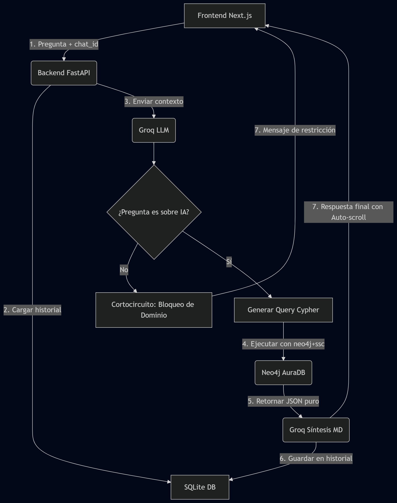

# Agente-de-IA-personal-para-consultas

# 🤖 GraphRAG Academic Agent — Inteligencia Artificial Full-Stack

Este repositorio alberga un **Agente de IA avanzado basado en Grafos (GraphRAG)** diseñado para interactuar, analizar y extraer conocimiento complejo de una base de datos de publicaciones científicas en Inteligencia Artificial. El sistema combina el razonamiento semántico de un Modelo de Lenguaje Grande (LLM) con la precisión matemática y relacional de un grafo, permitiendo resolver consultas contextuales complejas que los sistemas RAG tradicionales basados en vectores no pueden abordar con eficiencia.

La solución está construida bajo una arquitectura de **Monorepo** moderna, dividida en un backend analítico en **FastAPI** y una interfaz de usuario interactiva en **Next.js**.

