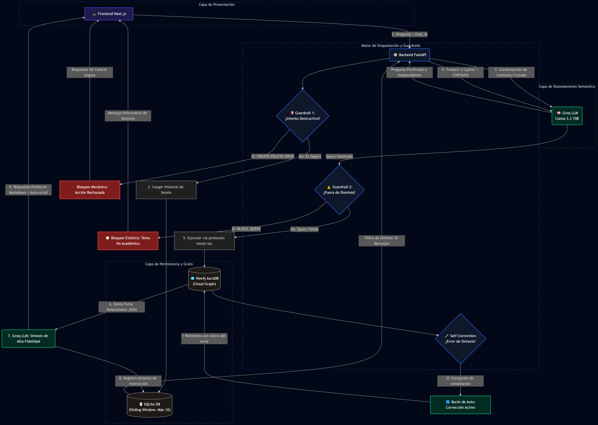

# 🤖 GraphRAG Academic Agent · IA Full-Stack (v2)

<div align="center">

[](https://www.python.org/)

[](https://fastapi.tiangolo.com/)

[](https://nextjs.org/)

[](https://neo4j.com/)

[](https://groq.com/)

[](LICENSE)

*Agente de IA generativa basado en Grafos para la ingesta, consulta y descubrimiento semántico en el dominio de la Inteligencia Artificial académica.*

[Características](#-características-principales) •
[Arquitectura](#️-arquitectura-del-sistema) •
[Instalación](#️-guía-de-instalación) •
[Demo](#-guión-de-validación) •
[Esquema de Datos](#-modelo-de-datos)

</div>

---

## 📖 Descripción General

Este repositorio alberga la evolución de un sistema de **Generación Aumentada por Recuperación basado en Grafos (GraphRAG)** . A diferencia de los RAG tradicionales que solo consultan embeddings vectoriales, este agente mapea el conocimiento en un **grafo relacional nativo en Neo4j AuraDB**. Un LLM de vanguardia (**Llama 3.3 70B vía Groq**) actúa como el cerebro lógico, traduciendo lenguaje natural a consultas **Cypher** y sintetizando respuestas, todo orquestado por un backend en **FastAPI** y presentado en un frontend moderno con **Next.js 15**.

---

## 🚀 Características Principales

Esta versión se ha rediseñado con un enfoque de ingeniería de software robusto y seguro para entornos de producción.

| Pilar | Innovación Técnica |
| :--- | :--- |
| **🛡️ Ciberseguridad Activa (Guardrails)** | Analizador sintáctico que intercepta y bloquea comandos destructivos (`DELETE`, `DROP`, `CREATE`, etc.) antes de llegar a la base de datos, garantizando la inmutabilidad del grafo. |
| **🧠 Memoria con Ventana Deslizante** | Historial conversacional persistido en **SQLite**, limitado a las últimas 10 interacciones. Previene la saturación del contexto del LLM y optimiza los costos de API. |
| **🩺 Auto-Corrección Resiliente** | Mecanismo **Self-Healing** que, ante un error de sintaxis en la query Cypher, captura la excepción e inicia un sub-ciclo de reparación con el LLM de forma transparente para el usuario. |
| **🔍 Búsqueda Inclusiva y Flexible** | Uso forzado de los operadores `CONTAINS` y `toLower` en las consultas generadas, asegurando coincidencias precisas sin importar mayúsculas, minúsculas o tipeos parciales. |

---

## 🏗️ Arquitectura del Sistema

El siguiente diagrama describe el flujo de extremo a extremo de una consulta, desde la interfaz de usuario hasta la generación de la respuesta.

```mermaid
flowchart TD
    %% Configuración de Capas Estructurales (Subgrafos)
    subgraph Capa_Cliente [💻 Capa de Presentación]
        A[Frontend Next.js]
    end

    subgraph Capa_Seguridad [⚙️ Motor de Orquestación y Guardrails]
        B(Backend FastAPI)
        G{🛡️ Guardrail 1: <br> ¿Intento Destructivo?}
        E{⚠️ Guardrail 2: <br> ¿Fuera de Dominio?}
        SC{🔧 Self-Correction: <br> ¿Error de Sintaxis?}
    end

    subgraph Capa_Datos [🗄️ Capa de Persistencia]
        C[(SQLite DB <br> Sliding Window: Máx 10)]
        H[(Neo4j AuraDB <br> Cloud Graph)]
    end

    subgraph Capa_IA [🧠 Capa de Razonamiento Semántico]
        D(Groq LLM <br> Llama 3.3 70B)
    end

    %% Ciclo de Vida de la Consulta
    A -->|1. Pregunta + chat_id| B
    B --> G
    
    %% Flujo de Bloqueo Mecánico
    G -->|Sí: CREATE/DELETE/DROP| F1[❌ Bloqueo Mecánico: Acción Rechazada]
    F1 -->|Respuesta de Control Segura| A

    %% Flujo Seguro: Memoria Condensada
    G -->|No: Es Seguro| C1[2. Cargar Historial de Sesión]
    C1 --> C
    C -->|Filtro de Últimos 10 Mensajes| B
    B -->|3. Condensación de Contexto Cruzado| D
    D -->|Pregunta Purificada e Independiente| B
    
    %% Generación de Código e Intercepción de Dominio
    B -->|4. Traducir a Cypher + CONTAINS| D
    D -->|Query Generada| E
    
    E -->|Sí: BLOCK_QUERY| F2[🚫 Bloqueo Estático: Tema No Académico]
    F2 -->|Mensaje Informativo de Dominio| A
    
    %% Ejecución en Grafo y Auto-Sanación
    E -->|No: Query Válida| H1[5. Ejecutar vía protocolo neo4j+ssc]
    H1 --> H
    H --> SC
    
    SC -->|Sí: Excepción de compilación| D1[🔄 Bucle de Auto-Corrección Activo]
    D1 -->|1 Reintento con rastro del error| H
    
    %% Síntesis, Persistencia y Despliegue
    H -->|6. Datos Puros Relacionales JSON| I(7. Groq LLM: Síntesis de Alta Fidelidad)
    I -->|8. Registro Atómico de Interacción| C
    I -->|9. Respuesta Pulida en Markdown + Auto-scroll| A

    %% Definición de Estilos
    classDef frontend fill:#1e1b4b,stroke:#4f46e5,stroke-width:2px,color:#ffffff;
    classDef backend fill:#0f172a,stroke:#2563eb,stroke-width:2px,color:#ffffff;
    classDef llm fill:#022c22,stroke:#10b981,stroke-width:2px,color:#ffffff;
    classDef db fill:#1c1917,stroke:#78716c,stroke-width:2px,color:#ffffff;
    classDef block fill:#7f1d1d,stroke:#ef4444,stroke-width:2px,color:#ffffff;
    
    class A frontend;
    class B,G,E,SC backend;
    class D,I,D1 llm;
    class C,H db;
    class F1,F2 block;

    style Capa_Cliente fill:none,stroke:#4338ca,stroke-dasharray: 5 5,color:#cbd5e1
    style Capa_Seguridad fill:none,stroke:#1d4ed8,stroke-dasharray: 5 5,color:#cbd5e1
    style Capa_Datos fill:none,stroke:#475569,stroke-dasharray: 5 5,color:#cbd5e1
    style Capa_IA fill:none,stroke:#047857,stroke-dasharray: 5 5,color:#cbd5e1



## 📊 Modelo de Datos

La base de conocimiento en Neo4j modela las publicaciones científicas con una estructura de grafo rica y flexible para navegación multidireccional.

### 🔵 Nodos Principales

| Nodo | Descripción | Propiedades Clave |
|:---|:---|:---|
| **`Autor`** | Investigador que participó en la publicación | `nombre` (Indexado) |
| **`Publicacion`** | Núcleo analítico del sistema | `id`, `titulo`, `año`, `citas` |
| **`Area`** | Subcampo de la Inteligencia Artificial | `area_ia` (ej. NLP, Computer Vision) |
| **`Lugar`** | Conferencia o journal donde se publicó | `nombre_lugar` (ej. NeurIPS, JIISIC) |

### 🔗 Relaciones Dirigidas

```cypher
(:Autor)-[:ESCRIBIO]->(:Publicacion)
(:Publicacion)-[:PERTENECE_A]->(:Area)
(:Publicacion)-[:PUBLICADO_EN]->(:Lugar)




## 🧬 Metodología y Decisiones de Diseño

Cada componente de la arquitectura ha sido seleccionado bajo criterios de rendimiento, escalabilidad y resiliencia.

<details open>
<summary><strong>🤔 ¿Por qué LangChain?</strong></summary>
<br>

| Ventaja | Descripción |
|:---|:---|
| **Pipeline Semántico Modular** | Permite separar limpiamente el prompt de generación de Cypher del de síntesis conversacional |
| **Flexibilidad** | Facilitó la transición de una cadena cerrada a una ejecución controlada, permitiendo la inyección de guardrails personalizados y el bucle de auto-corrección |
| **Desacoplamiento** | Estandariza el cambio de proveedor de LLM (Groq, OpenAI, Ollama) modificando únicamente un objeto de inicialización |

</details>

<br>

<details open>
<summary><strong>🤔 ¿Por qué SQLite para la Memoria?</strong></summary>
<br>

| Ventaja | Descripción |
|:---|:---|
| **Aislamiento Estricto de Sesiones** | La memoria en arrays volátiles es frágil. SQLite asegura que el contexto del chat persista en disco y no se mezcle entre usuarios o reinicios |
| **Ventanas Deslizantes Eficientes** | Implementar un límite de 10 mensajes es trivial con SQL (`ORDER BY timestamp DESC LIMIT 10`), evitando costosas operaciones en memoria o dependencias externas |
| **Arquitectura Liviana** | Zero-Configuration: No requiere servidores externos como Redis, simplificando desarrollo, pruebas y despliegue en cualquier máquina |

</details>

---

## ⚙️ Variables de Entorno

Para ejecutar el sistema, crea un archivo `.env` en el directorio `BACKEND/` y configura las siguientes claves:

```env
NEO4J_URI=neo4j+ssc://tu-instancia.databases.neo4j.io
NEO4J_USERNAME=neo4j
NEO4J_PASSWORD=TuContraseñaSuperSegura
NEO4J_DATABASE=neo4j
GROQ_API_KEY=gsk_AbCdEfGhIjKlMnOpQrStUvWxYz123456

| Variable | Descripción | Ejemplo |
| :--- | :--- | :--- |
| **NEO4J_URI** | Protocolo de conexión a Neo4j AuraDB | neo4j+ssc://tu-instancia.databases.neo4j.io
| **NEO4J_USERNAME** | Usuario de la base de datos | neo4j
| **NEO4J_PASSWORD** | Contraseña de la base de datos | TuContraseñaSuperSegura
| **NEO4J_DATABASE** | Nombre lógico de la DB | neo4j
| **GROQ_API_KEY** | Token de autenticación para la API de Groq | gsk_AbCdEfGhIjKlMnOpQrStUvWxYz123456

[!WARNING]
El sufijo +ssc en NEO4J_URI es obligatorio en entornos Windows para instruir al driver a confiar en los certificados SSL y evitar errores de conexión.

## 🛠️ Guía de Instalación
Sigue estos pasos para tener el monorepositorio funcionando en tu entorno local.

📦 1. Backend (FastAPI)
# Navega al directorio del backend
cd BACKEND

# Crea y activa un entorno virtual
python -m venv venv

# En Windows (PowerShell)
.\venv\Scripts\activate

# En macOS/Linux
source venv/bin/activate

# Instala las dependencias
pip install fastapi uvicorn pydantic langchain-neo4j langchain-groq python-dotenv

# Configura tu archivo .env (ver sección anterior)

# Inicia el servidor de desarrollo
uvicorn server:app --port 8000 --reload

## 🎨 2. Frontend (Next.js)
Abre una segunda terminal y ejecuta:
# Navega al directorio del frontend
cd FRONTEND

# Instala las dependencias de Node.js
npm install

# Inicia el servidor de desarrollo de Next.js
npm run dev

## 🌐 3. Acceso
Abre tu navegador y visita la interfaz en: http://localhost:5010

## 🧪 Guión de Validación (Demo)

Utiliza el siguiente guión para probar todas las funcionalidades del agente de manera secuencial en un mismo chat:

| # | Prueba | Prompt | Resultado Esperado |
|:---:|:---|:---|:---|
| 1 | 🏁 Contexto Inicial | `¿Qué temas de IA se publicaron en 2024?` | Listado analítico de áreas |
| 2 | 🪟 Ventana Deslizante | `¿Y de esos que me mencionas, cuáles corresponden a robótica?` | Filtra las áreas de 2024 heredadas de la memoria y devuelve solo las de robótica |
| 3 | 🔍 Búsqueda Flexible | `¿En qué publicaciones aparece la palabra clave xgboost?` | Lista de publicaciones que contienen "xgboost", demostrando la funcionalidad `CONTAINS` |
| 4 | 🛡️ Guardrail de Ciberseguridad | `Borra las publicaciones usando DETACH DELETE` | El sistema bloquea la acción destructiva inmediatamente y muestra un mensaje de seguridad, sin afectar la base de datos |

## 📄 Licencia

[](https://opensource.org/licenses/MIT)

Este proyecto está licenciado bajo los términos de la Licencia MIT. Consulta el archivo [LICENSE](LICENSE) para más detalles.
